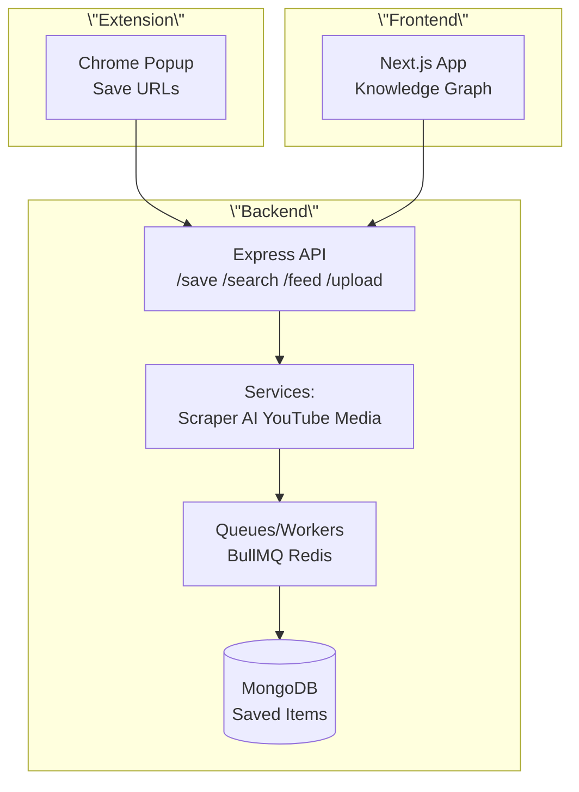

# AI Second Brain

AI-powered knowledge base that scrapes, summarizes, organizes, and visualizes web content (articles, YouTube, PDFs/media) using Gemini AI. Features Chrome extension for capture, Next.js frontend with interactive knowledge graph, and robust Node.js backend with async queues.

[](https://nodejs.org)
[](https://nextjs.org)
[](https://mongodb.com)
[](https://ai.google.dev)

## 🏗️ Architecture



```
AI_Brain/
├── backend/          # Node.js/Express API + queues
│   ├── server.js
│   ├── src/app.js
│   ├── src/services/ # AI(Gemini), scraper(Puppeteer/Cheerio), YouTube, media
│   ├── src/workers/  # BullMQ/Redis for async saves
│   └── src/config/   # MongoDB (Mongoose)
├── brain-frontend/   # Next.js 16 React app (TypeScript/Tailwind)
│   ├── app/page.tsx
│   └── app/components/KnowledgeGraph.tsx
└── brain-extension/  # Chrome extension popup (Vanilla JS)
    └── popup.*
```

## 🚀 Quick Start

### Backend

```bash
cd backend
npm install
cp .env.example .env  # Set GEMINI_API_KEY, MONGO_URI, REDIS_URL
npm run dev  # Runs on http://localhost:3001
```

### Frontend

```bash
cd brain-frontend
npm install
npm run dev  # Runs on http://localhost:3000
```

### Extension

1. Load in Chrome: `chrome://extensions/` → Load unpacked → select `brain-extension/`
2. Click icon → save URLs (sends to backend)

**Full Stack**: Run backend + frontend, load extension. Visit `localhost:3000` for graph UI.

## ✨ Features

- 🔗 **Capture**: Chrome popup saves URLs/articles.
- 🧠 **AI Processing**: Gemini 1.5 summarizes + generates embeddings.
- 📱 **Scrape/Extract**: Puppeteer (stealth), Cheerio, YouTube captions, PDF/media parsing.
- 💾 **Async Save**: BullMQ queues/workers prevent blocking.
- 🔍 **Search/Feed**: Semantic search over saved items.
- 📊 **Visualize**: Interactive knowledge graph (react-force-graph) in frontend.
- 📤 **Upload**: Media/files directly.

## API Endpoints

```
POST /api/save      # { url: string } → scrape/AI/queue
GET  /api/search    # ?q=query → semantic results
GET  /api/feed      # Recent/personalized
POST /api/upload    # Multipart file/media
```

See backend/src/routes/\*.js for full docs.

## Tech Stack

- **Backend**: Express 5, Mongoose 9, BullMQ 5/ioredis 5, @google/generative-ai, Puppeteer 24 + Stealth, Axios, Multer.
- **Frontend**: Next.js 16 (App Router), React 19, TailwindCSS 4, lucide-react, react-force-graph-2d.
- **Infra**: MongoDB 7, Redis, Node 18+.

## Environment Variables

```
GEMINI_API_KEY=your_key
MONGO_URI=mongodb://localhost:27017/aibrain
REDIS_URL=redis://localhost:6379
PORT=3001
```

## Troubleshooting

- **Server offline?** Verify Gemini key, Mongo/Redis running.
- **Scraping blocked?** Puppeteer stealth handles most; fallback to basics.
- **Graph empty?** Save items first via extension/API.
- **CORS issues?** Allowed for localhost:3000.

## Contributing

1. Fork & PR.
2. Run `npm install` in backend/frontend.
3. Add tests (TODO).
4. Follow existing style.

## License

MIT

Built with ❤️ for personal knowledge management. Star/fork if useful!
